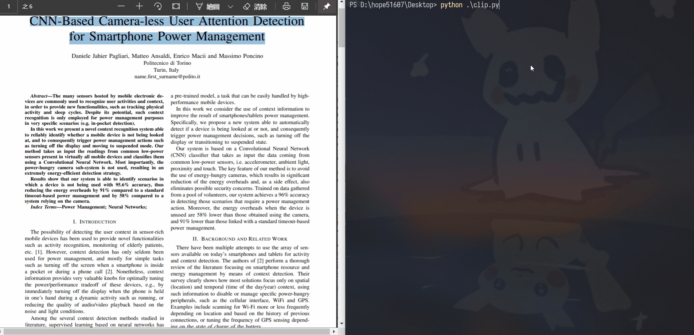

# Realtime PDF Translate
### 即時 PDF 翻譯


## Dependency
- Windows
- python3
- pypiwin32
- selenium
- pynput

## How To Use
1. 
    install dependencies
    ```sh
    pip install pypiwin32 selenium pynput
    ```
2. 
    Edit source code line 6 to use your prefer browser.
    - default is my prefer browser: new Microsft Edge

3. 
    Make sure your browser driver is in your environment path.
    - You can find more information from [here](https://www.selenium.dev/documentation/en/webdriver/driver_requirements/#adding-executables-to-your-path).
    
4. 
    run script
    ```sh
    python realtime_pdf_translate.py
    ```

5. 
    copy pdf text and enjoy

## Demo


## 說穿了就是自動幫你做下列步驟
1. 用 selenium 打開 google 翻譯
2. 按下 ctrl+c 時自動把 windows 剪貼簿裡的換行刪掉
3. 把結果丟到 google 翻譯


> 期末報告要報 paper，對英文苦手來說真的是生不如死，
> 論文 pdf 複製的文字下來會一堆換行，
> 丟翻譯就會翻得很怪，
> 手動去掉換行實在太麻煩了，
> 就寫了這個來逃避現實中 QQ
